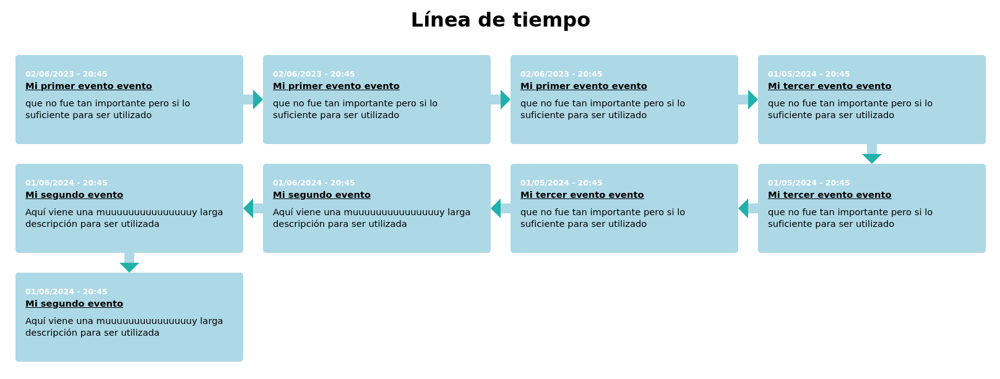

# TimelineGen

Genera una línea de tiempo en formato html desde un archivo csv

El resultado es un archivo html que se ve así:



# Uso
Crear una copia del archivo **timeline-example.csv**
y renombrarlo como: **timeline.csv**

y luego ejecutar el script así:

```bash
python3 main.py
```

Esto parseará y el archivo timeline.csv y generará un archivo html para ver la línea de tiempo. Este archivo se puede imprimir y modificar de ser necesario.

Se le puede pasar otro nombre de archivo de entrada o path y un nombre diferente para el archivo de salida.

```bash
python3 main.py -f <nombre_del_archivo_entrada> -o <nombre_del_archivo_salida>
```

# Ejemplo del formato del archivo de entrada (csv)

Son 4 campos separadas por ,
- fecha (Formato AÑO-MES-DIA HH:II)*
- título
- descripcion
- link (opcional)

*el formato de la fecha puede ser sin las horas y los minutos

```csv
2023-09-05 20:45,Mi primer evento evento,Descripcion,http://google4.com
2023-12-15 19:45,Mi segundo evento evento,Descripcion,
2022-12-15 19:45,Mi Tercer evento evento,Descripcion,http://da.to
```